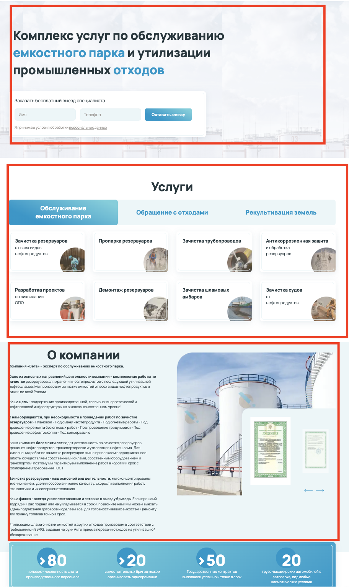

## Client

Содержит в себе следующие директории
- `core` - движок обеспечивающий интеграцию с административным
интерфесом а так же набор вспомогательных инструментов
- `config` - параметры приложения, для каждого окружения свои
- `pages` - системные страницы обеспечивающие работу роутинга **не создавайте
свои страницы там**
- `public` - next app
- `scripts` - дополнительные node.js утилиты, например для генерации
- `static` - next app
- `templates` - основная рабочая папка, папка для шаблонов

Все папки в проекте `client` кроме `templates` считаются ядром данного приложения
и выполняет роль по сбору и выводу данных из административного интерфеса.

> В процессе разработка (вёрстки шаблона) вам **не потребуется** вносить каких либо изменений.
> Все изменения в целом кроме папки `templates` считаются ключевыми.

Шаблон (`template`) для клиентской части это в основном описание
визуальной части, вёрстки по компонентам.

В разработке на этом решении мы придерживаемся концепции дробления страниц
на логические горизонтальные компоненты для последующего использования в административной
части

Например:

Каждый выделенный компонент будет являтся отдельным `section`
и разрабатывается отдельно в папке
`templates/{templateName}/sections/${sectionName}` разработчиком.
В основном сначала верстка а потом интеграция с API.

Компоненты `section` состоят из вью компонента, стилей и параметрами
Например для [crud сущностей](./crud-client-settings.md)

### Типы `sections`

- Простой `section` по выводу вёрстки
- С данными, вёрстка и базовая интеграция на `nodeParams`
- Crud секции для вывода кастомный моделей данных и сложные модулей
они отличаются префиксом __crud и постфиксом о подтипе,

Single - Подробная запись в карточке
List - список элементов
